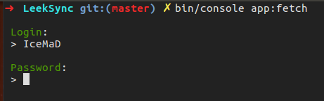
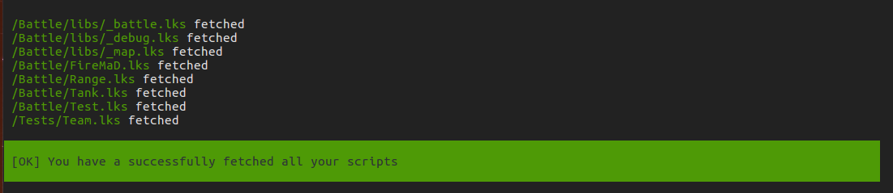
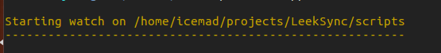
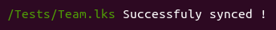
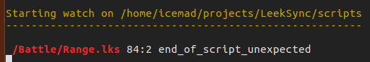

LeekTools
========

[English version](README.md)

Application en ligne de commande (utilisant [Symfony](https://symfony.com/)) pour synchroniser les fichiers IA locaux et [LeekWars](http://leekwars.com)

Pour utiliser cette application, vous devez avoir installé [PHP](http://php.net/) et [Composer](https://getcomposer.org/doc/00-intro.md) sur votre ordinateur.

Une fois ces dépendances installées, clonez (ou téléchargez) ce projet et suivez ces étapes

## Récupérer vos scripts

```bash
bin/console:fetch
```

Votre compte et votre mot de passe vous seront demandés.



> Celles-ci ne sont pas stockées, mais si vous ne me faites pas confiance (et ne faites jamais confiance à personne sur Internet), vous pouvez consulter mon code.
> Ca vous rassurera et vous pourriez avoir des idées d’améliorations :D

Une fois que vous avez entré vos identifiants, vous devriez voir ce message de confirmation:



Et tous vos scripts devraient être dans le dossier `scripts` à l'intérieur de ce projet.

> Remarque: ce dossier sera personnalisable dans une version future.

## Commencer à travailler

```bash
bin/console app:watch
```

Encore une fois, mettez vos identifiants (Si vous trouvez cela ennuyeux, voir [Stocker les identifiants](#stocker-les-identifiants)), vous devriez voir ce message:



Commencez à éditer vos fichiers, sauvegardez et ... tadaa!



Si votre code n'est pas valide, le résultat le montrera



Ici, il me manque un ";" à la ligne 84

## Stocker les identifiants

Si vous trouvez ça ennuyant de taper vos identifiants tout le temps, vous pouvez les stocker dans le fichier `.env` à la racine du projet.
