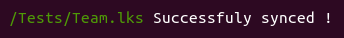

# LeekTools

Application en ligne de commande pour synchroniser les fichiers IA locaux et [LeekWars](http://leekwars.com)

## Prérequis

LeekTools utilise [PHP](http://php.net/) et [Composer](https://getcomposer.org/doc/00-intro.md)

Voici quelques tutoriels pour les principaux

#### Ubuntu (Adaptable aux autres distributions en remplaçant apt par le bon gestionnaire de packet)

Installation de PHP et composer
```bash
sudo apt install php7.2-cli php7.2-mbstring php7.2-xml php7.2-zip
php -r "copy('https://getcomposer.org/installer', 'composer-setup.php');"
php -r "if (hash_file('sha384', 'composer-setup.php') === '48e3236262b34d30969dca3c37281b3b4bbe3221bda826ac6a9a62d6444cdb0dcd0615698a5cbe587c3f0fe57a54d8f5') { echo 'Installer verified'; } else { echo 'Installer corrupt'; unlink('composer-setup.php'); } echo PHP_EOL;"
php composer-setup.php
php -r "unlink('composer-setup.php');"  
sudo sudo mv composer.phar /usr/local/bin/composer
```

Installation de LeekTools
```bash
git sudo clone https://github.com/IceMaD/LeekTools.git
cd LeekTools
composer install
```

#### Mac

J'ai pas de Mac sous la main mais ça devrait pas être trop différent de Linux. Il me semble même que PHP est installé par défaut sur Mac.

#### Windows

On va installer Linux sur windows, et ça prend du temps (mais pas d'inquiétude, il n'y a presque rien à faire, juste à attendre) !

Commencer par installer bash pour windows en suivant ce [Tutoriel](https://korben.info/installer-shell-bash-linux-windows-10.html) jusqu'à avoir Ubuntu sur Windows.


Ensuite executer les commandes suivantes pour être sur qu'on est à jour et installer ce qui manque ainsi que l'outils :

Mise à jour d'ubuntu (pas requis, mais recommandé s'il viens d'être installé)
```bash
sudo apt update
sudo apt upgrade
```

Installation de PHP et composer
```bash
sudo apt install php7.2-cli php7.2-mbstring php7.2-xml php7.2-zip
php -r "copy('https://getcomposer.org/installer', 'composer-setup.php');"
php -r "if (hash_file('sha384', 'composer-setup.php') === '48e3236262b34d30969dca3c37281b3b4bbe3221bda826ac6a9a62d6444cdb0dcd0615698a5cbe587c3f0fe57a54d8f5') { echo 'Installer verified'; } else { echo 'Installer corrupt'; unlink('composer-setup.php'); } echo PHP_EOL;"
php composer-setup.php
php -r "unlink('composer-setup.php');"  
sudo sudo mv composer.phar /usr/local/bin/composer
```

Installation de LeekTools
```bash
git sudo clone https://github.com/IceMaD/LeekTools.git
cd LeekTools
composer install
```

Pour faire le lien avec windows, utiliser la configuratation **APP_SCRIPTS_DIR** comme expliqué dans la section [Personnaliser l'outils](#personnaliser-loutils) en gardant en tête que dans Ubuntu, le disque `C:\\` se situe dans `/mnt/c` et que les `\` doivent être remplacer par des `/`.

Par exemple, si mon dossier est `C:\Users\Marc\Desktop\scripts`, je doit mettre `/mnt/c/Users/Marc/Desktop/scripts`.

## Récupérer mes scripts

```bash
bin/console scripts:fetch
```

Votre compte et votre mot de passe vous seront demandés.


> Celles-ci ne sont pas stockées, mais si vous ne me faites pas confiance (et ne faites jamais confiance à personne sur Internet), vous pouvez consulter mon code.
> Ca vous rassurera et vous pourriez avoir des idées d’améliorations :D

Une fois que les identifiants rentrés, ce message de confirmation apparait:


Et tous les scripts devraient être dans le dossier `scripts` à l'intérieur de ce projet (ou dans le [dossier personnalisé](#personnaliser-loutils)).

## Commencer à travailler

### Lancer l'observateur

L'observateur est un script qui va observer le dossier scripts sur le PC et répliquer tous les changements qu'il détecte sur le site de LeekWars.

Il n'est pas capable de savoir quand des modifications ont été effectuées sur le site. Pour récupérer les scripts depuis le site, voir [Récuperer mes scripts](#rcuprer-mes-scripts)

```bash
bin/console scripts:watch
```

Encore une fois, mettre les identifiants; ce message devrait apparaitre:


Commencer à éditer les fichiers d'IA, sauvegarder et ... tadaa!



Si le code n'est pas valide, le résultat le montrera


Ici, il me manque un ";" à la ligne 9 (29 ème caractère)

### Opérations prises en compte

Les opérations suivantes sont automatiquement synchronisées vers le site :

- Création d'une IA
- Suppression d'une IA
- Modification du contenu d'une IA
- Modification du nom d'une IA
- Déplacement d'une IA d'un dossier à un autre dossier
- Déplacement de plusieurs IAs d'un dossier à un autre dossier
- Création d'un dossier (Le dossier n'est synchronisé qu'une fois qu'une IA est crée dedans)
- Suppression d'un dossier (Et de toutes les IAs qui sont dedans)
- Modification du nom d'un dossier
- Déplacement d'un dossier dans un autre dossier

Les opérations suivantes **NE SONT PAS** gérés (et feront planter le script) :

- Déplacement de plusieurs dossiers d'un coup dans un autre dossier
- Changer l'extension d'une IA pendant que l'observateur tourne

## Personnaliser l'outils

Il est possible de personnaliser l'outils en changeant la configuration.
Pour ce faire, créer un fichier nommé `.env.local` à coté du fichier `.env`.

Dans ce fichier, il y 4 paramètres possibles :

**APP_LOGIN**     
Le nom de compte (pour éviter de le retaper à chaque fois, il fonctionnera même si APP_PASSWORD est vide)

**APP_PASSWORD**     
Le mot de passe (pour éviter de le retaper à chaque fois)

**APP_FILE_EXTENSION**     
L'extension à utiliser pour les fichiers locaux (défaut: js)

**APP_SCRIPTS_DIR**     
Le dossier du PC dans lequel les scripts seront copiés

Exemple:

```dotenv
APP_LOGIN=IceMaD
APP_PASSWORD=M0N-M0T-D3-P4553-5UP3R-53CR3T
APP_FILE_EXTENSION=lks
APP_SCRIPTS_DIR=/home/icemad/scripts
```

## Developpé avec

* [Symfony](https://symfony.com/)
* [LeekWars](https://leekwars.com/help/api)

Et plus d'infos dans le composer.json

## Versioning

Pour le moment, c'est une alpha donc je ne versionne pas.
