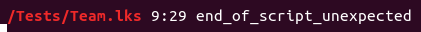

# LeekTools

Application en ligne de commande pour synchroniser les fichiers IA locaux et [LeekWars](http://leekwars.com)

## Prérequis

Pour utiliser cette application, vous devez avoir installé [PHP](http://php.net/) et [Composer](https://getcomposer.org/doc/00-intro.md) sur votre ordinateur.

/!\ 
Attention : Pour le moment, je n'ai testé que sur Linux.
Mac étant similaire, il ne devrais pas y avoir de problème. 
Si quelqu'un peut faire des tests sous Windows et me dire si ça fonctionne, ce serait cool :)

## Pour commencer

Pour installer toutes les dépendances:

```bash
composer install
```

## Récupérer mes scripts

```bash
bin/console scripts:fetch
```

Votre compte et votre mot de passe vous seront demandés.


> Celles-ci ne sont pas stockées, mais si vous ne me faites pas confiance (et ne faites jamais confiance à personne sur Internet), vous pouvez consulter mon code.
> Ca vous rassurera et vous pourriez avoir des idées d’améliorations :D

Une fois que vous avez entré vos identifiants, vous devriez voir ce message de confirmation:


Et tous vos scripts devraient être dans le dossier `scripts` à l'intérieur de ce projet.

> Remarque: ce dossier sera personnalisable dans une version future.

## Commencer à travailler

### Lancer l'observateur

L'observateur est un script qui va observer votre dossier de scripts sur votre PC et répliquer tous les changements qu'il détecte sur le site de LeekWars.

Il n'est pas capable de savoir quand des modifications ont été effectuées sur le site. Pour récupérer les scripts depuis le site, voir [Récuperer mes scripts](#rcuprer-mes-scripts)

```bash
bin/console scripts:watch
```

Encore une fois, mettez vos identifiants (Si vous trouvez cela ennuyeux, voir [Personnaliser l'outils](#personnaliser-loutils)), vous devriez voir ce message:


Commencez à éditer vos fichiers, sauvegardez et ... tadaa!


Si votre code n'est pas valide, le résultat le montrera



Ici, il me manque un ";" à la ligne 9 (29 ème caractère)

### Opérations prises en compte

Les opérations suivantes sont automatiquement synchronisées vers le site :

- Création d'une IA
- Suppression d'une IA
- Modification du contenu d'une IA
- Modification du nom d'une IA
- Déplacement d'une IA d'un dossier à un autre dossier
- Déplacement de plusieurs IAs d'un dossier à un autre dossier
- Création d'un dossier (Le dossier n'est synchronisé qu'une fois qu'une IA est crée dedans)
- Suppression d'un dossier (Et de toutes les IAs qui sont dedans)
- Modification du nom d'un dossier
- Déplacement d'un dossier dans un autre dossier

Les opérations suivantes **NE SONT PAS** gérés (et feront planter le script) :

- Déplacement de plusieurs dossiers d'un coup dans un autre dossier

## Personnaliser l'outils

Vous pouvez personnaliser l'outils en changeant la configuration.
Pour ce faire, créez un fichier nommé `.env.local` à coté du fichier `.env`.

Dans ce fichier, vous pouvez configurer 4 paramètres :

**APP_LOGIN**     
Votre nom de compte (pour éviter de le retaper à chaque fois, vous pouvez le renseigner même si vous ne remplissez pas le paramètre APP_PASSWORD)

**APP_PASSWORD**     
Votre mot de passe (pour éviter de le retaper à chaque fois)

**APP_FILE_EXTENSION**     
L'extension que vous voulez utiliser pour les fichiers locaux (défaut: js)

**APP_SCRIPTS_DIR**     
Le dossier de votre PC dans lequel vous voulez que vos scripts soient copiés

Exemple:

```dotenv
APP_LOGIN=IceMaD
APP_PASSWORD=M0N-M0T-D3-P4553-5UP3R-53CR3T
APP_FILE_EXTENSION=lks
APP_SCRIPTS_DIR=/home/icemad/scripts
```

## Developpé avec

* [Symfony](https://symfony.com/)
* [LeekWars](https://leekwars.com/help/api)

Et plus d'infos dans le composer.json

## Versioning

Pour le moment, c'est une alpha donc je ne versionne pas.
